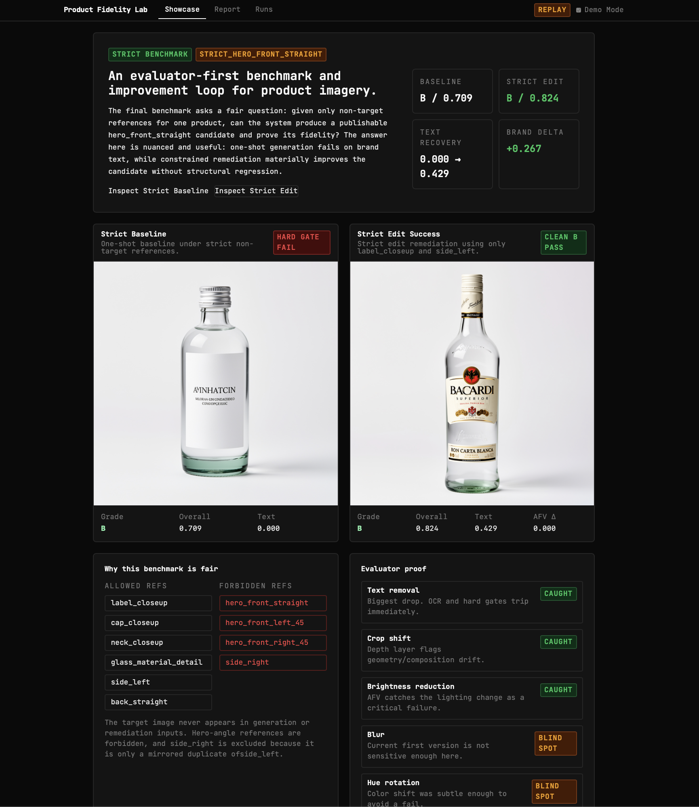
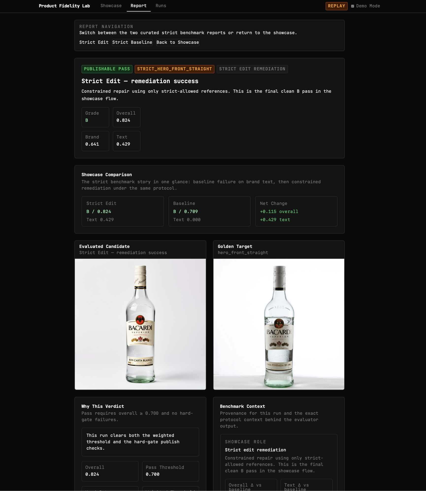
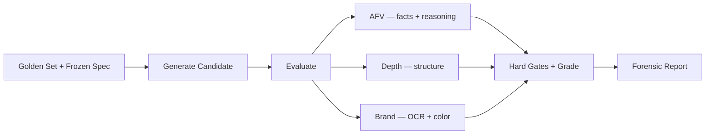

# Product Fidelity Lab

When an AI-generated product shot looks plausible at first glance, how do you actually prove it's good enough to publish?

This project is my answer to that. It's an evaluation system and improvement loop for AI-generated product photography. Given only non-target reference images of a product, it generates a held-out candidate for a target shot, evaluates it against a frozen golden benchmark, identifies exactly where it fails, and applies constrained remediation to improve fidelity, all under a strict protocol that prevents the target image from ever leaking into the inputs.

## Start here

If you only spend 2 minutes on this repo:

1. Read the strict benchmark result below.
2. Open the replay demo and inspect `Strict Baseline` vs `Strict Edit`.
3. Skim the case study at [`docs/case-study.md`](docs/case-study.md).



## The claim

Under a strict held-out protocol, one-shot generation fails on brand-critical text. Constrained edit remediation materially improves fidelity without structural regression. The evaluator proves both claims with evidence.

## At a glance

| Question        | Answer                                                                              |
| --------------- | ----------------------------------------------------------------------------------- |
| What is it?     | An evaluator-first benchmark and improvement loop for product imagery               |
| Why is it fair? | Frozen golden specs, hard gates, calibrated thresholds, strict non-leaking protocol |
| What failed?    | One-shot generation under the strict protocol                                       |
| What worked?    | Constrained edit remediation using only allowed references                          |
| What matters?   | The evaluator proves the delta, not just visual intuition                           |

## Benchmark results

Protocol: `strict_hero_front_straight` , target image and all hero angles forbidden from inputs.

| Stage             | Grade | Overall | Text  | Brand | AFV Delta |
| ----------------- | ----- | ------- | ----- | ----- | --------- |
| One-shot baseline | B     | 0.709   | 0.000 | 0.374 | —         |
| Edit remediation  | B     | 0.824   | 0.429 | 0.641 | 0.000     |

The edit recovered BACARDI label text (0.000 -> 0.429), improved brand score by +0.267, and reached 0.824 overall, with zero AFV regression and positive depth deltas across all 8 runs. Full experiment details live in `docs/experiments/`.

## Demo flow

- Replay demo: `uv run pfl-demo --replay`
- Start on the `Showcase` tab
- Open `Strict Baseline` to see the one-shot failure
- Open `Strict Edit` to see the remediation result
- Use the report view to inspect verdict logic, AFV evidence, OCR matches, color fidelity, and benchmark context



## How it works

### Evaluator

Candidates are evaluated against a curated golden set using three concurrent layers:



**Atomic Fact Verification (AFV)** — Sends the candidate and a curated list of facts to Gemini. Gets back per-fact verdicts with confidence and reasoning. Critical facts trigger hard gates.

**Structural Integrity** — Depth Anything V2 generates depth maps for golden and candidate, then compares with SSIM, correlation, and MSE. Catches geometry and composition drift.

**Brand Integrity** — OCR extracts text and matches against expected brand tokens. KMeans extracts dominant colors, compared via Delta-E CIE2000. Missing critical text is a hard gate.

**Hard gates** — Some failures are non-negotiable. A beautiful image with the wrong label text auto-fails regardless of score.

**Calibration** — Grade thresholds come from self-evaluating the golden set and freezing the resulting distributions.

**Perturbation validation** — Controlled degradations (blur, crop shift, hue rotation, text removal, brightness reduction) prove the evaluator catches real problems. 3 of 5 detected with clear score drops.

### Benchmark protocol

The strict benchmark enforces what counts as fair:

- The target shot never appears in generation or edit inputs
- Hero-angle references are forbidden (too close to the target viewpoint)
- Mirror-duplicate shots are excluded as non-independent
- Budget is capped
- Success criteria are defined before running

See `docs/benchmark-protocol.md` for full details.

For a short narrative walkthrough, see [`docs/case-study.md`](docs/case-study.md).

### Improvement loop

1. **Generate** baseline candidate from strict references
2. **Evaluate** it, the evaluator identifies blank label text as a hard-gate failure
3. **Search** , systematic exploration proves prompt tuning alone can't fix it (22 runs, 0.000 text across all configs)
4. **Remediate** , constrained edit using only `label_closeup` and `side_left` recovers label text
5. **Re-evaluate** , the evaluator confirms the improvement and checks for structural regression

This is not pure one-shot generation. It's an evaluator-guided pipeline that treats generation failures as inputs to a remediation step, and uses the evaluator to prove the fix worked.

## Supporting experiment history

These runs are included to show the iteration path that led to the final strict benchmark. The canonical path through the project is the strict baseline plus strict edit remediation.

| Experiment                          | Runs  | Cost      | Finding                                                                   |
| ----------------------------------- | ----- | --------- | ------------------------------------------------------------------------- |
| Perturbation suite                  | 5     | —         | Evaluator catches 3/5 controlled degradations                             |
| One-shot search (label-fidelity-v1) | 22    | $0.95     | Prompt/reference/guidance tuning cannot recover label text                |
| Reference-conditioned edit          | 7     | $0.42     | Edit with target reference produces A grades (secondary evidence)         |
| Held-out one-shot                   | 16    | $0.80     | Confirms ceiling without hero angles                                      |
| Held-out edit                       | 8     | $0.24     | Non-leaking remediation works, but still relies on a hero-angle reference |
| **Strict baseline**                 | **4** | **$0.20** | **Text 0.000 across all runs under strict protocol**                      |
| **Strict edit**                     | **8** | **$0.48** | **Text 0.429, brand +0.267, zero AFV regression**                         |

Total paid experiment cost: ~$3.09

## What remains unsolved

- Text score reached 0.429 under the strict protocol, not 1.0. Fine-print text is not fully recovered.
- No A grades under the strict protocol so far. The held-out experiment with hero angles produced A grades, but the stricter protocol has currently topped out at B.
- Deterministic label compositing would likely close the remaining gap but was not needed to prove the core claim.

## Quick start

### Replay demo (no API keys)

```bash
uv sync
uv run pfl-demo --replay
# http://localhost:8000
```

In replay mode, start with the `Showcase` tab. It opens on the strict benchmark story with a curated baseline failure and strict remediation success.

### Live mode

```bash
uv sync
cp .env.example .env
# add FAL_KEY and GEMINI_API_KEY

uv run python scripts/prepare_golden.py
uv run python scripts/run_calibration.py
uv run pfl-demo --live
```

### Run the strict benchmark

```bash
uv run python scripts/run_strict_baseline.py     # 4 runs, ~$0.20
uv run python scripts/run_strict_edit.py         # 8 runs, ~$0.48
```

Older scripts such as `run_search.py`, `run_heldout_search.py`, and `run_label_edit.py` are still in the repo as supporting experiment history, but they are not the main benchmark path anymore.

## Project structure

```
├── src/product_fidelity_lab/
│   ├── api/                    # FastAPI routes
│   ├── evaluation/             # AFV, depth, brand, aggregation, calibration
│   ├── generation/             # FLUX generation, edit, prompt strategies
│   ├── models/                 # Pydantic domain models
│   ├── storage/                # SQLite, diskcache, replay
│   ├── benchmark_protocol.py   # Protocol enforcement
│   ├── search.py               # Search experiment infrastructure
│   ├── config.py
│   └── main.py
├── frontend/
│   └── index.html              # Preact + HTM, zero-build SPA
├── data/
│   ├── golden/                 # Reference images + frozen specs
│   ├── benchmarks/             # Benchmark protocol definitions
│   ├── calibration/            # Frozen grade thresholds
│   └── runs/experiments/       # All experiment artifacts
├── docs/
│   ├── assets/                # README screenshots
│   ├── case-study.md          # Short narrative walkthrough
│   ├── benchmark-protocol.md   # What counts as leakage, what's allowed
│   └── experiments/            # Per-experiment memos
├── scripts/                    # Baseline, search, edit, calibration, perturbations
└── tests/                      # 174 tests (unit + integration)
```

## Tech stack

| Area       | Technology                           |
| ---------- | ------------------------------------ |
| Backend    | FastAPI, Python 3.12+                |
| Models     | Pydantic v2                          |
| VLM        | Gemini 2.5                           |
| Generation | fal.ai FLUX.2 flex (+ edit endpoint) |
| OCR        | fal.ai GOT-OCR 2.0                   |
| Depth      | fal.ai Depth Anything V2             |
| Color      | scikit-learn KMeans, Delta-E CIE2000 |
| Storage    | SQLite (aiosqlite), diskcache        |
| Frontend   | Preact + HTM, zero build             |
| Quality    | pytest, Ruff, Pyright (strict)       |

174 tests passing, ruff clean, pyright strict clean.
