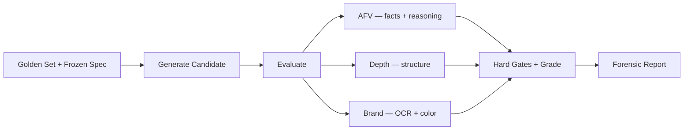

# Product Fidelity Lab

When an AI-generated product shot looks plausible at first glance, how do you actually prove it's good enough to publish?

This project is my answer to that. It's an evaluation system for AI-generated product photography — it generates candidate images, runs them against a frozen golden benchmark, and produces forensic reports that explain exactly what's wrong and why. The evaluator is the interesting part, not the generation.

## The problem

Most image generation demos stop at "looks nice." Product photography has harder requirements. Brand text needs to be readable. Colors need to match actual brand specs, not just look vaguely right. Geometry needs to hold up. And when something fails, you need to know *why* — a score alone doesn't help anyone fix the shot.

I wanted to turn those requirements into something measurable, reproducible, and honest about its own limitations.

## How it works

Candidates are evaluated against a curated golden set using three concurrent layers:



**Atomic Fact Verification (AFV)** — Sends the candidate and a curated list of facts to Gemini. Gets back per-fact verdicts with confidence and reasoning. Critical facts trigger hard gates — if the bottle cap is missing, it doesn't matter how nice the lighting is.

**Structural Integrity** — Depth Anything V2 generates depth maps for golden and candidate, then I compare with SSIM, correlation, and MSE. Catches geometry and composition drift that's easy to miss visually.

**Brand Integrity** — OCR extracts text and matches it against expected brand tokens. KMeans extracts dominant colors, compared via Delta-E CIE2000 in LAB space. Missing critical text is a hard gate.

### Hard gates

Some failures are non-negotiable. If a critical fact is false or critical brand text is missing, the image auto-fails regardless of score. This is the part that makes it useful for real product work — a beautiful image with the wrong label is still wrong.

### Calibration

Grade thresholds aren't hand-picked. They come from self-evaluating the golden set and freezing the resulting distributions. The system knows what "good" looks like because it measured it.

### Perturbation validation

To prove the evaluator catches real problems, I run it against controlled degradations of golden images — blur, crop shift, hue rotation, text removal, brightness reduction. If it can't detect these, its scores are meaningless.

## Results

The perturbation suite catches 3 out of 5 degradations with clear score drops:

- **Text removal** — biggest drop (A to C), caught both the obscured label and inferred missing content
- **Crop shift** — depth layer caught the geometry change, SSIM dropped to 0.416
- **Brightness** — AFV caught the lighting change as a critical fact failure

Blur and hue rotation are current blind spots. The perturbations were subtle enough that the evaluator didn't flag them. I think that's a reasonable first version — it detects meaningful failures, not every possible one.

On the generation side, FLUX.2 flex hits a visible ceiling: it gets the bottle shape, pose, cap, and liquid right, but produces blank labels. The evaluator catches this consistently (best candidate: C grade, 0.697). That's the system working as intended — the evaluator is more discerning than the generator.

## Quick start

### Replay demo (no API keys)

```bash
uv sync
uv run pfl-demo --replay
# http://localhost:8000
```

Ships with 7 curated runs — generation candidates at different quality levels plus the perturbation suite. Good way to see what the system does without spending credits.

### Live mode

```bash
uv sync
cp .env.example .env
# add FAL_KEY and GEMINI_API_KEY

uv run python scripts/prepare_golden.py
uv run python scripts/run_calibration.py
uv run pfl-demo --live
```

### Perturbations

```bash
uv run python scripts/run_perturbations.py hero_front_straight
```

### Generate + evaluate

```bash
uv run python scripts/run_live_test.py hero_front_straight
```

## Exploring the demo

If you want to get the point quickly:

1. Start in replay mode
2. Look at a near-miss candidate — something that looks okay but fails on brand text
3. Look at an obvious failure — the evaluator should be harsh and specific
4. Open a perturbation report — this is how I prove the evaluator isn't just making up numbers
5. Check the baseline golden self-eval — it should score high, confirming the rubric works

That order makes the evaluator-first story land fast.

## API

OpenAPI docs at `http://localhost:8000/docs`.

| Method | Endpoint                 | Purpose                             |
| ------ | ------------------------ | ----------------------------------- |
| `POST` | `/api/evaluate`          | Evaluate a candidate against a spec |
| `POST` | `/api/generate`          | Generation job                      |
| `POST` | `/api/generate/for-spec` | Spec-aware multi-reference gen      |
| `GET`  | `/api/runs/{id}`         | Poll run status and results         |
| `GET`  | `/api/runs`              | List stored runs                    |
| `GET`  | `/api/golden/specs`      | List golden specs                   |
| `GET`  | `/api/replay/runs`       | List replay runs                    |

## Project structure

```
├── src/product_fidelity_lab/
│   ├── api/                    # FastAPI routes
│   ├── evaluation/             # AFV, depth, brand, aggregation, calibration
│   ├── generation/             # FLUX generation + prompt building
│   ├── models/                 # Pydantic domain models
│   ├── storage/                # SQLite, diskcache, replay
│   ├── config.py
│   └── main.py
├── frontend/
│   └── index.html              # Preact + HTM, zero-build SPA
├── data/
│   ├── golden/                 # Reference images + frozen specs
│   ├── calibration/            # Frozen grade thresholds
│   └── replay/                 # Curated demo runs
├── scripts/                    # Preparation, calibration, live tests, perturbations
└── tests/
```

## Tech stack

| Area       | Technology                           |
| ---------- | ------------------------------------ |
| Backend    | FastAPI, Python 3.12+                |
| Models     | Pydantic v2                          |
| VLM        | Gemini 2.5                           |
| Generation | fal.ai FLUX.2 flex                   |
| OCR        | fal.ai GOT-OCR 2.0                  |
| Depth      | fal.ai Depth Anything V2             |
| Color      | scikit-learn KMeans, Delta-E CIE2000 |
| Storage    | SQLite (aiosqlite), diskcache        |
| Frontend   | Preact + HTM, zero build             |
| Quality    | pytest, Ruff, Pyright (strict)       |

103 tests passing, ruff clean, pyright strict clean.

## Cost

- Evaluate a candidate: ~$0.06
- Re-evaluate (cached): ~$0.01
- Generate + evaluate: ~$0.11

Cheap enough to iterate fast, with caching and replay so you're not paying twice for the same work.
